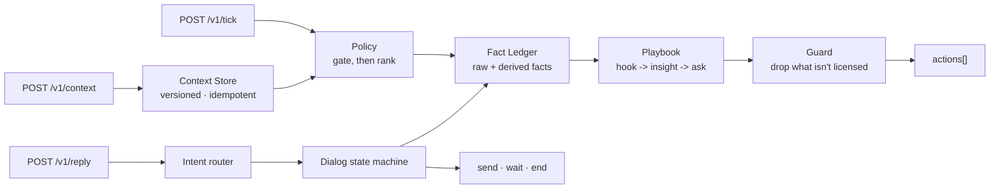
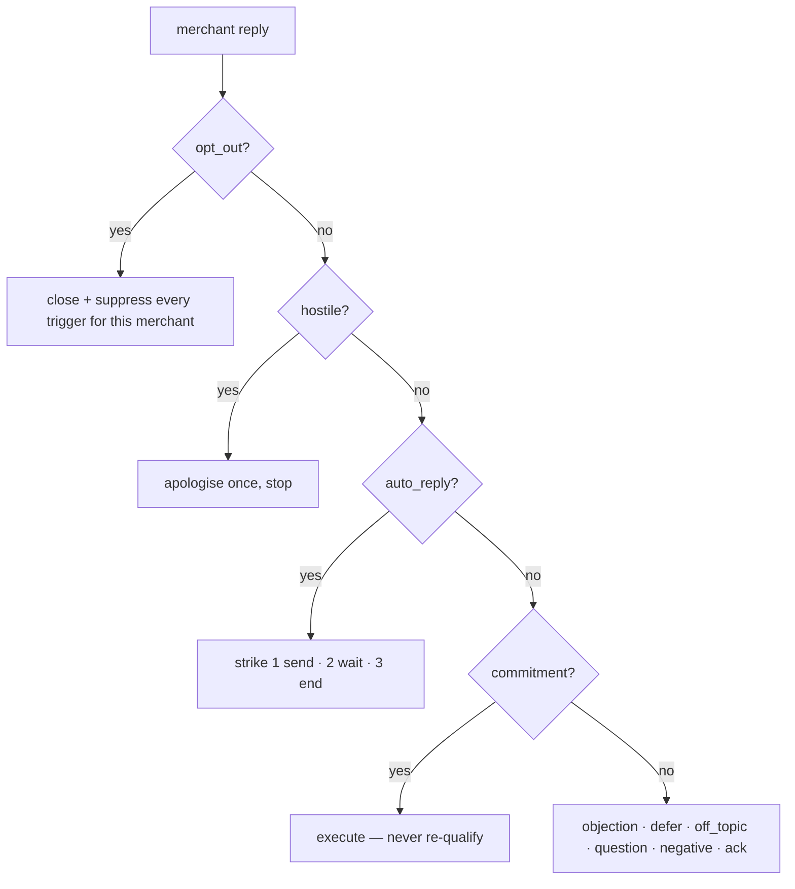

# Vera-G

A grounded merchant assistant for the magicpin AI Challenge.
**Every number in every message traces back to the field it came from.**

**Live:** https://vera-ex06.onrender.com · **Team** SmoothOperator · **Dhanu Gupta** · dhanugupta.dev@gmail.com · v1.0.0

```
POST /v1/context   POST /v1/tick   POST /v1/reply   GET /v1/healthz   GET /v1/metadata
```

```bash
curl https://vera-ex06.onrender.com/v1/healthz
```

---

## The problem

Vera messages small-business merchants on WhatsApp. A message only works if it says something
**this specific merchant can verify** — their number, their competitor, their journal.

The trap is in the dataset. I counted before writing code:

| | |
|---|---|
| Merchants with **empty** `offers`, `signals`, `conversation_history`, `review_themes` | **40 / 50** |
| Triggers whose payload is literally `{"placeholder": true}` | **75 / 100** |

So a bot tuned on the rich examples scores beautifully on ten merchants and says
*"you should improve your profile"* to the other forty.

> **Specificity when the context is thin is the whole game.**

The second trap: an LLM writing freely will invent the number it needs. The rubric scores
invented context **lowest of all**.

---

## The approach

Two decisions follow from that.

**1. Facts before prose.** Every context push is distilled into a ledger of
`Fact(display, value, source_path)`. A message can only say what the ledger holds. When the
payload is empty, *derived* facts carry the message — every merchant has views and a CTR, every
category has a peer median, and that arithmetic is enough for a claim the merchant can check on
their own dashboard.

**2. No LLM in the request path.** The brief requires determinism; the judge caps a call at 30s
and a tick can carry 20 actions. A model call per action is a timeout risk and a hallucination
risk, for variety I don't need — the interesting variation here comes from the contexts, not
from sampling. Measured **p95 = 2 ms**.

---

## The solution



| Stage | What it does | Why it matters |
|---|---|---|
| **Context Store** | Versioned per `(scope, id)`. Re-push returns `409 stale_version`. Diffs `digest` ids across versions. | The bot knows which digest items are **new**, so Phase-3 injections get used. |
| **Policy** | Gates *before* it ranks: opted out, hostile, expired, suppression spent, already messaged. | Restraint. Merchant and customer budgets are separate. |
| **Fact Ledger** | `Fact(display, value, source)` + derived peer-gap arithmetic. | The only thing a playbook is allowed to say. |
| **Playbook** | 33 trigger kinds, each `hook → insight → ask`. Rich path and thin path. | A `perf_dip` on a merchant *above* peer median is reframed as discovery, not conversion. |
| **Guard** | Drops ungrounded numerals, strips URLs and identifiers, drops taboo terms, collapses extra CTAs. | Hallucination becomes structurally unavailable, not just discouraged. |

---

## Example

Real output from the deployed bot — trigger `trg_001_research_digest_dentists`, merchant
`m_001_drmeera_dentist_delhi`.

> Dr. Meera, JIDA Oct 2026 landed. 3-month fluoride varnish recall outperforms 6-month for
> high-risk adult caries. 2,100-patient trial. Multi-center Indian trial shows 38% lower caries
> recurrence with 3-month vs 6-month recall in adults with active decay history. No effect in
> low-risk patients. **Aapki list ke 124 high risk adults** par seedha lagu hota hai. 2-minute
> abstract aur ek patient-facing note bhej dun jo aap forward kar sakein? YES bolein.
> — JIDA Oct 2026, p.14.

Every fragment resolves to a pushed field:

| Fragment | Source path |
|---|---|
| `Dr. Meera` | `merchant.identity.owner_first_name` |
| `JIDA Oct 2026, p.14` | `category.digest[d_2026W17_jida_fluoride].source` |
| `3-month fluoride varnish recall outperforms…` | `category.digest[…].title` |
| `2,100-patient trial` | `category.digest[…].trial_n` |
| `38% lower caries recurrence…` | `category.digest[…].summary` |
| `124 high risk adults` | `merchant.customer_aggregate.high_risk_adult_count` × `category.digest[…].patient_segment` |

<details>
<summary><b>The same bot on a merchant with nothing in the record</b></summary>

<br>

`m_049_komal_pharmacie_lucknow` has no offers, no signals, no history, no review themes.
The trigger payload is literally `{"placeholder": true, "metric_or_topic": "renewal_due"}`.

> Komal, Pro renewal 278 din mein hai. Is mahine 34 calls — peer median se 12 zyada.
> Abhi renew kar dun taaki listing band na ho? YES bolein.

Still specific. `12` is `derived(calls - peer.avg_calls_30d)` — pure arithmetic over two fields
that are never missing. This is what carries the other 40 merchants.

</details>

<details>
<summary><b>The guard, on a deliberately bad draft</b></summary>

<br>

**Draft in:**

> Dr. Meera, JIDA Oct 2026 landed. ~~Your listing pulled 7,412 views last week.~~
> ~~This protocol is guaranteed to work for every patient.~~ ~~https://jida.org.in/oct2026.~~
> Want the 2-minute abstract? Should I draft the patient note too?

**Out:**

> Dr. Meera, JIDA Oct 2026 landed. Want the 2-minute abstract. Should I draft the patient note too?

**Flags raised:** `stripped_url` · `dropped_taboo:guaranteed` · `dropped_ungrounded:7412` · `collapsed_extra_questions`

`7412` is not in the ledger's licensed set, so the whole sentence goes — the guard never
rewords, because rewording is where invention creeps in.

| Rule | Harness consequence | Guard action |
|---|---|---|
| ungrounded numeral | fabricating data not in context | drop the sentence |
| URL | hard fail, −3 each | strip |
| raw identifier | internal jargon, −1 | strip / de-snake |
| category taboo | category fit, legal risk for dentists | drop the sentence |
| more than one ask | multiple-CTA anti-pattern | demote all but the last |
| repeated body | −2 anti-repetition | end the conversation instead |

</details>

<details>
<summary><b>Reply routing — the three replay scenarios</b></summary>

<br>



`commitment` outranks `question` on purpose: *"Ok lets do it. What's next?"* contains a question
mark, and resolving it as a question is exactly the failure the brief calls out.

Auto-reply fingerprints live in **merchant** memory, not conversation memory — a WhatsApp
Business responder answers every thread with the same text, so a repeat counts even when the
judge opens a fresh `conversation_id`.

**1 · Auto-reply hell** — same canned text four times:

| Turn | Bot |
|---|---|
| 2 | `send` — "Ye canned response lagta hai… Owner phone par ho tab YES bhej dijiye." |
| 3 | `wait` |
| 4 | `end` |

**2 · Intent transition** — merchant asks price, then commits:

| Turn | Merchant | Bot |
|---|---|---|
| 2 | "how much does this cost me?" | `send` — answers from context, one CONFIRM |
| 3 | "ok let's do it" | `send` — "Kar rahi hoon. Abstract nikaal kar… note draft kar rahi hoon." **no second gate** |
| 4 | "yes go ahead" | `send` — "Us par kaam chalu hai — aapko aur kuch nahi karna." |

**3 · Hostile, then off-topic:**

| Turn | Merchant | Bot |
|---|---|---|
| 2 | "this is garbage" | `send` — apologises once, offers to stop |
| 3 | "help me file my GST?" | `send` — "GST filing mere haath mein nahi hai — wo aapke CA ka kaam hai." then back on-mission |
| 4 | "STOP" | `end` |

Follow-through is scoped to the thread's own trigger, and each plan sentence is spent once —
a thread never repeats itself.

</details>

---

## Try the live bot

Free tier, so the first call after idle may take ~30s to wake.

```bash
BOT=https://vera-ex06.onrender.com

# 1. identity + liveness
curl $BOT/v1/healthz
curl $BOT/v1/metadata

# 2. push a category and a merchant
curl -X POST $BOT/v1/context -H 'Content-Type: application/json' \
  -d "{\"scope\":\"category\",\"context_id\":\"dentists\",\"version\":1,\
       \"payload\":$(cat dataset/categories/dentists.json),\
       \"delivered_at\":\"2026-04-26T09:00:00Z\"}"

# 3. ask it to act
curl -X POST $BOT/v1/tick -H 'Content-Type: application/json' \
  -d '{"now":"2026-04-26T10:30:00Z","available_triggers":["trg_001_research_digest_dentists"]}'

# 4. reply as the merchant
curl -X POST $BOT/v1/reply -H 'Content-Type: application/json' \
  -d '{"conversation_id":"conv_demo","merchant_id":"m_001_drmeera_dentist_delhi",
       "from_role":"merchant","message":"ok lets do it","turn_number":2,
       "received_at":"2026-04-26T10:45:00Z"}'
```

Re-pushing the same version returns `409 stale_version`; an unknown scope returns `400`.

## Run it locally

```bash
pip install -r requirements.txt
uvicorn vera.app:app --host 0.0.0.0 --port 8080 --workers 1   # one worker: state is in-process

python3 selftest.py http://localhost:8080     # 84 assertions, no API key needed
```

Offline entry points: `bot.py::compose(category, merchant, trigger, customer)` (§7.1) and
`conversation_handlers.py::respond(state, message)` (§7.4).
Deploy targets: `Dockerfile`, `render.yaml`, `fly.toml`, `Procfile`.

---

## Verification

| Check | Result |
|---|---|
| `selftest.py` over real HTTP through the judge's lifecycle | **84 / 84** |
| Composed across the full expanded dataset (100 triggers × 50 merchants) | **100 / 100**, zero crashes |
| Messages sent without a verifiable number | **0** |
| Median body length | 273 characters |
| p95 latency (30s judge budget) | **2 ms** |

## Trade-offs

- **No LLM in the loop.** Buys determinism, millisecond latency and zero hallucination; costs the
  linguistic surprise a frontier model would bring. The scored dimensions are all functions of
  *which fact you choose*, not of prose novelty — and §7.1 requires determinism anyway.
- **Restraint costs scored surface.** Refusing to send when nothing is groundable means fewer
  messages for the judge to score. The brief says restraint is rewarded; I took it at its word.
- **Hand-written playbooks don't generalise for free.** An unknown kind routes by scope to a
  default that still composes from the peer-gap engine, so it degrades to "specific but
  generic-framed" rather than to nothing.

## What context would have helped most

1. **Search-impression data per listing.** The strongest real Vera line in the brief is
   *"6,777 missed searches in Sector 14"*. Nothing in the dataset supports that — impressions,
   query terms, and the discovery-vs-conversion split are the missing half of every performance
   message, and CTR alone forces me to infer.
2. **What the merchant did after each past message.** `conversation_history.engagement` has tags
   but no outcome. Knowing which lever actually earned a reply *from this merchant* would turn
   variant selection from deterministic rotation into a learned policy.
3. **The merchant's own service list and price points.** I fall back to the category catalog when
   `offers` is empty — correct, but generic. Their real menu would make every offer line theirs.
